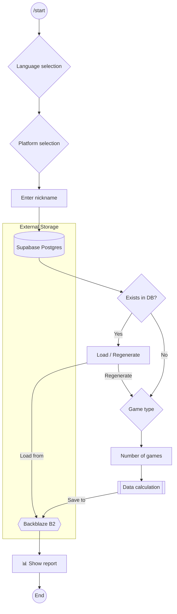
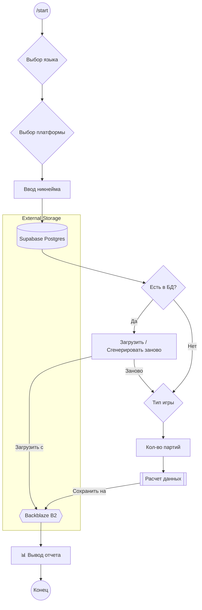

# ChessGizmoTelegramBot
<p align="center">
  <a href="#chessgizmo-en">English</a> | 
  <a href="#chessgizmo-ru">Русский</a>
</p>

<span id="chessgizmo-en"></span>

A Telegram bot that analyzes a user's Chess.com games, determines their playing style (by comparing them to great chess players), and generates detailed visual reports (heat maps, opening trees, and diagrams).

The bot is built on **aiogram 3.x** using **FSM (Finite State Machine)** to manage the dialog logic.

## 🚀 Features

* **Multi-platform:** Supports Chess.com and Lichess. * **Style Definition:** Comparison of your playing style with 15+ grandmasters (Tal, Carlsen, Fischer, etc.).
* **Deep Analytics:**
  * 🌳 **Opening Tree**: A sunburst chart displaying your repertoire.
  * 🔥 **Heatmap**: Visualizes the density of your piece movements. Allows you to identify dominant zones of control and favorite squares (e.g., kingside bias or central pressure).
  * ☁️ **Marked Raincloud**: A comparative graph that compares your activity metrics (rooks, queens, knights, bishops) with players of your rating. The "You" line clearly shows whether you play more actively or passively than average.
  * 🎻 **Versus Violin** (Violin diagrams) showing the probability density of game odds. Allows you to see *attack and defense balance*, *bishop vs. knight development*.
  * 🏆 **Achievements Report**: A summary infographic with a predicted ML-model rating (for wins, draws, and losses) and an achievement system to demonstrate your playing style.
* **Flexible logic:**
  * Check for player presence in the database (caching).
  * Select the number of games to analyze (Blitz/Rapid).
  * Bilingual interface (RU/EN).

---

## 📂 Project Structure and Operation Logic (FSM)

The bot uses a state machine to navigate through the questionnaire steps.



```plaintext
├── main.py # Entry point, FSM, and handlers
├── keyboards.py # Inline keyboards and text
├── telegram_bot_data_generator # Graph generation, interaction with chessgizmo
├── .env # Tokens and secrets
└── pyproject.toml # Dependencies
```

## 📸 Screenshots of work
Below is the process of first interaction with the bot: choosing a platform, entering a nickname, and receiving the final chess card with style and graphs.


Thanks to the Supabase integration, the bot remembers your data. If the report has already been generated, the bot will offer to instantly download it from Backblaze B2 or refresh the data again.


## 📦 Tech Stack

* **Python 3.9+**
* **Aiogram 3** — an asynchronous framework for the Telegram API.
* **Internal modules:**
* [`chessgizmo`](https://github.com/tehnik-tehnolog/ChessGizmoProject) — working with the Supabase database, B2 Basket, and chess platform APIs. Calculations and image rendering
* `telegram_bot_data_generator` — convenient work with the `chessgizmo` library, obtaining datasets for image generation.

## 🛠️ Installation and Launch

### 1. Cloning the repository
```bash
git clone https://github.com/tehnik-tehnolog/ChessGizmoTelegramBot.git
cd ChessGizmoTelegramBot
```
### 2. Installing dependencies
```bash
# Installing via uv
uv sync

# Or the classic pip method
pip install .
```
### 3. Setting environment variables

Create a `.env` file in the root of the project. The bot uses this data to connect to the **Supabase** (PostgreSQL) database and **Backblaze B2** cloud storage:

```env
# Telegram
TELEGRAM_BOT_TOKEN = your_telegram_token
NUM_GAMES = 100 # Game limit for analysis
STOCKFISH_PATH = "your_path_to_stockfish_in_linux/stockfish/stockfish-windows-x86-64-avx2"
STOCKFISH_PATH = "your_path_to_stockfish_in_windows/stockfish/stockfish-windows-x86-64-avx2.exe"

# Supabase / PostgreSQL Connection
HOST=your_supabase_host
PORT=your_supabase_port
USER=your_db_user
PASSWORD=your_db_password

# Backblaze B2 Storage
B2_ENDPOINT=https://s3.your_region.backblazeb2.com
B2_KEY_ID=your_key_id
B2_APPLICATION_KEY=your_application_key
B2_REGION=your_region

# Chess Platforms
LICHESS_TOKEN=your_lichess_api_token
```
### 4. Configuring Stockfish
Make sure Stockfish is installed on your system. Specify the path to the binary in the environment variables.

### 5. Launch
```bash
# If using uv
uv run main.py

# If using regular Python
python main.py
```

## 📝 State Descriptions

List of states defined in the `Form` class:

| State | Description |
| :--- | :--- |
| **language** | Select the interface language |
| **room** | Select the platform (Chess.com/Lichess) |
| **nickname** | Wait for a nickname |
| **database_exists** | Select the action if the data is already in the cache |
| **game_type** | Select the mode (Blitz/Rapid) |
| **num_games** | Select the number of games |
| **wait** | Wait for calculations to complete |
| **style_report** | Print a text description of the style |

## 📄 License

👤 Author

tehnik-tehnolog  📧 pavelkos91011@gmail.com

[MIT](https://choosealicense.com/licenses/mit/)

---

<span id="chessgizmo-ru"></span>

Телеграм-бот, который анализирует партии пользователя с Chess.com, определяет стиль игры (сравнивая с великими шахматистами) и генерирует подробные визуальные отчеты (тепловые карты, деревья дебютов и диаграммы).

Бот построен на **aiogram 3.x** с использованием **FSM (Finite State Machine)** для управления логикой диалогов.


## 🚀 Возможности

* **Мультиплатформенность:** Поддержка Chess.com и Lichess.
* **Определение стиля:** Сравнение стиля игры с 15+ гроссмейстерами (Таль, Карлсен, Фишер и др.).
* **Глубокая аналитика:**
    * 🌳 **Opening Tree** (Дерево дебютов): Радиальная диаграмма (**Sunburst chart**), отображающая ваш репертуар.
    * 🔥 **Heatmap** (Тепловая карта): Визуализирует плотность перемещения фигур. Позволяет определить доминирующие зоны контроля и поля-фавориты (например, перекос на королевский фланг или давление в центре).
    * ☁️ **Marked Raincloud** (Распределение активности): Сравнительный график, где ваши показатели активности (ладьи-ферзи, кони, слоны) сопоставляются с игроками вашего рейтинга. Линия «You» наглядно показывает, играете ли вы активнее или пассивнее среднего уровня.
    * 🎻 **Versus Violin** (Скрипичные диаграммы) показывающие плотность вероятности игровых коэффициентов. Позволяют увидеть *баланс атаки и защиты*, *развитие слона vs коня*.
    * 🏆 **Achievements Report** (Отчет о достижениях): Сводная инфографика с предсказанным ML-моделью рейтингом (для побед, ничьих и поражений) и системой ачивок для демонстрирования стиль игры.
* **Гибкая логика:**
    * Проверка наличия игрока в базе данных (кэширование).
    * Выбор количества партий для анализа (Blitz/Rapid).
    * Двуязычный интерфейс (RU/EN).

---

## 📂 Структура проекта и Логика работы (FSM)

Бот использует машину состояний для навигации по шагам анкеты.



```plaintext
├── main.py                     # Точка входа, FSM и хендлеры
├── keyboards.py                # Инлайн-клавиатуры и тексты
├── telegram_bot_data_generator # Генерация графиков, взаимодейсвие с chessgizmo
├── .env                        # Токены и секреты
└── pyproject.toml              # Зависимости
```

## 📸 Скриншоты работы
Ниже представлен процесс первого взаимодействия с ботом: выбор платформы, ввод никнейма и получение итоговой шахматной карточки со стилем и графиками.


Благодаря интеграции с Supabase, бот запоминает ваши данные. Если отчет уже генерировался ранее, бот предложит мгновенно загрузить его из Backblaze B2 или обновить данные заново.


## 📦 Технологический стек

* **Python 3.9+**
* **Aiogram 3** — асинхронный фреймворк для Telegram API.
* **Внутренние модули:**
    * [`chessgizmo`](https://github.com/tehnik-tehnolog/ChessGizmoProject) — работа с БД Supabase, B2 Basket и API шахматных платформ. Вычисления и отрисовка картинок
    * `telegram_bot_data_generator` — удобная работа с библиотекой `chessgizmo`, получение датасетов для генерации изображений.

## 🛠️ Установка и запуск

### 1. Клонирование репозитория
```bash
git clone https://github.com/tehnik-tehnolog/ChessGizmoTelegramBot.git
cd ChessGizmoTelegramBot
```
### 2. Установка зависимостей
```bash
# Установка через uv
uv sync

# Либо классический способ через pip
pip install .
```
### 3. Настройка переменных окружения

Создайте файл `.env` в корне проекта. Бот использует эти данные для подключения к базе **Supabase**(PostgreSQL) и облачному хранилищу **Backblaze B2**:

```env
# Telegram
TELEGRAM_BOT_TOKEN = your_telegram_token
NUM_GAMES = 100  # Лимит партий для анализа
STOCKFISH_PATH = "your_path_to_stockfish_in_linux/stockfish/stockfish-windows-x86-64-avx2"
STOCKFISH_PATH = "your_path_to_stockfish_in_windows/stockfish/stockfish-windows-x86-64-avx2.exe"

# Supabase / PostgreSQL Connection
HOST=your_supabase_host
PORT=your_supabase_port
USER=your_db_user
PASSWORD=your_db_password

# Backblaze B2 Storage
B2_ENDPOINT=https://s3.your_region.backblazeb2.com
B2_KEY_ID=your_key_id
B2_APPLICATION_KEY=your_application_key
B2_REGION=your_region

# Chess Platforms
LICHESS_TOKEN=your_lichess_api_token
```
### 4. Настройка Stockfish
Убедитесь, что Stockfish установлен в вашей системе. Укажите путь к бинарному файлу в переменных среды.

### 5. Запуск
```bash
# Если использовали uv
uv run main.py

# Если использовали обычный python
python main.py
```

## 📝 Описание состояний (States)

Список состояний, определенных в классе `Form`:

| Состояние | Описание |
| :--- | :--- |
| **language** | Выбор языка интерфейса |
| **room** | Выбор платформы (Chess.com/Lichess) |
| **nickname** | Ожидание ввода никнейма |
| **database_exists** | Выбор действия, если данные уже есть в кэше |
| **game_type** | Выбор режима (Blitz/Rapid) |
| **num_games** | Выбор количества партий |
| **wait** | Ожидание завершения расчетов |
| **style_report** | Вывод текстового описания стиля |

## 📄 Лицензия

👤 Автор

tehnik-tehnolog  📧 pavelkos91011@gmail.com

[MIT](https://choosealicense.com/licenses/mit/)

